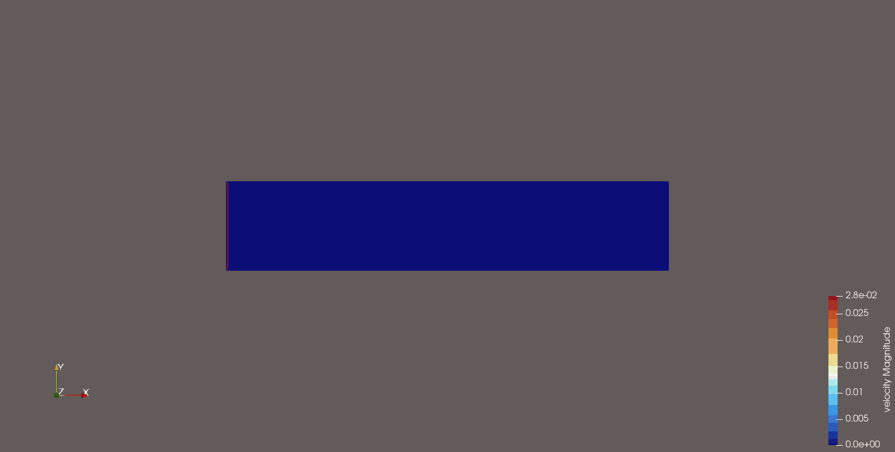
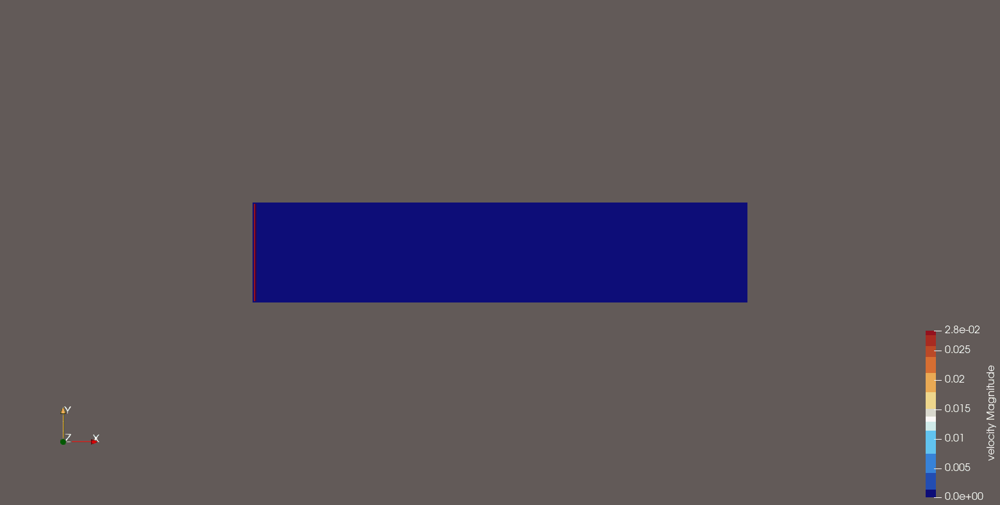

# Lattice Boltzmann Solver - 2D

The goal of this project was to implement a Lattice Boltzmann Solver for a given obstacle in a channel. The problem is solved in 2D domain.

This project was part of the course "Simulation and Scientific Computing 2 (SiWiR2)" during my masters. The code in the initial version is serial code written in C++17 and compiled on Linux OS using GCC compiler toolchain.

There are following possibilities for improving performance (reducing runtime):
1. Parallelize on CPU with _**OpenMP**_ &nbsp; [[🔗](https://www.openmp.org)]
2. Parallelize on GPU with _**Nvidia CUDA/C++**_ &nbsp; [[🔗](https://docs.nvidia.com/cuda/)]
3. Use _**Expression Templates**_ &nbsp; [[🔗](https://citeseerx.ist.psu.edu/document?repid=rep1&type=pdf&doi=ca2f8a9b7407de039957a358f995265ec8b769a9)]

<br>

### Team Members for the original project:
1. Nikhil VC &nbsp; [[🔗LinkedIn](https://www.linkedin.com/in/nikhil-vagga-5634b8111/)]
2. Nagesh AC &nbsp; [[🔗LinkedIn](https://www.linkedin.com/in/nagesh-a-c/)] &nbsp; [[🔗Github](https://github.com/NageshAC)]
3. Rishikesh (myself) &nbsp; [[🔗LinkedIn](https://www.linkedin.com/in/rishikesh-nerurkar/)] &nbsp; [[🔗Github](https://github.com/riciadavinci)]

<br>

### Requirements:
- C++ Compiler: &nbsp; _GCC_ / _Microsoft Visual C++_
- Build system: &nbsp; _CMake_
- Visualization tool: &nbsp; _Paraview_ to the results (_.vtk_ files)

<br>

### Download, Installation & Execution Steps:
1. Clone the repository

```bash
git clone "https://github.com/riciadavinci/LatticeBoltzmannSolver2D"
```

2. Move into the cloned repository

```bash
cd LatticeBoltzmannSolver2D
```

3. Create build directory and move into it

```bash
mkdir build && cd build
```

4. Configure & generate files (pre-build step) for building - Makefiles, *.vcxproj, etc.

```bash
cmake ..
```

5. Perform the build step

```bash
cmake --build .
```

6. Run the executable (see usage section below)
- The executable is called `lbm`
- On linux, the executable would be generated under `build/LatticeBoltzmannSolver` directory
- on Windows, the executable would be generated in the build directory according to the project settings:
    - `build/Debug/lbm.exe`
    - `build/Release/lbm.exe`
    - any other settings that the user may have setup

<br>

#### Usage on Linux:
```bash
./lbm <PARAMETERS>.dat
```

#### Usage on Windows:
```bash
lbm.exe <PARAMETERS>.dat
```

Here: `<PARAMETERS>.dat`: &nbsp; **Parameters file** - Please provide either the full path or proper relative path to these files.

#### Usage examples (linux):
1. `./lbm ../../files/params_Re40.dat` : corresponds to _cylinder geometry_ and **Reynolds number (Re) = 40**

2. `./lbm ../../files/params_Re500.dat` : corresponds to _cylinder geometry_ and **Reynolds number (Re) = 500**

3. `./lbm ../../files/params_Re100_wing.dat` : corresponds to _wing geometry_ and **Reynolds number (Re) = 100**

<br>

### Results:

1. _**Cylinder** geometry and **Re = 40**_




2. _**Cylinder** geometry and **Re = 500**_

<!--  -->


3. _**Wing** geometry and **Re = 100**_

<!--  -->


#### Note:
If you want to include a similar PARAMETERS.dat file like Re100_wing.dat, where the geometry is 
passed via the file, make sure that the geometry file <GEOMETRY>.pgm is located in the "files" 
directory within the project and also the geometry parameter should just be the filename: `<PARAMETERS>.dat` (see last last line of the following text snippet).

`<PARAMETERS>.dat` contents:
```text
timesteps 50000
Re 100
.
.
.
geometry <some_geometry>.pgm
```
